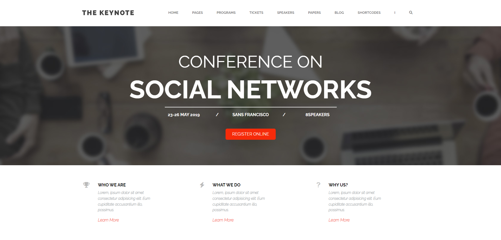
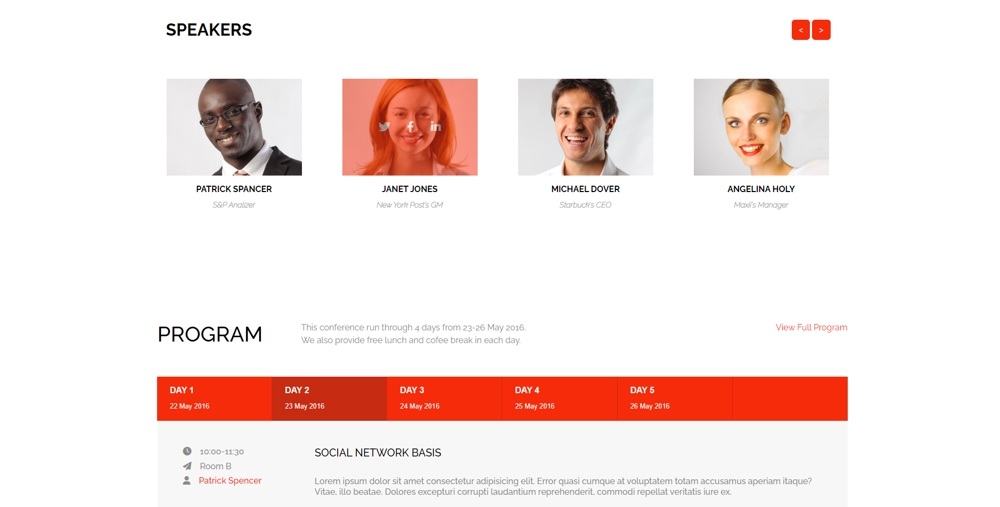
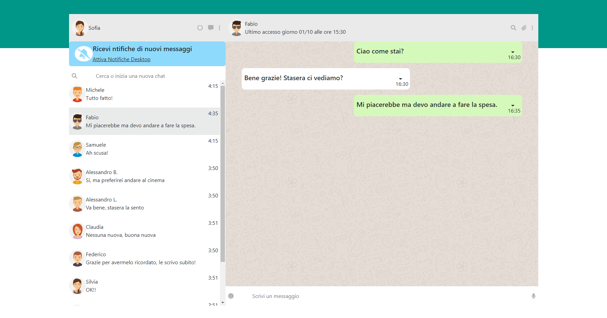
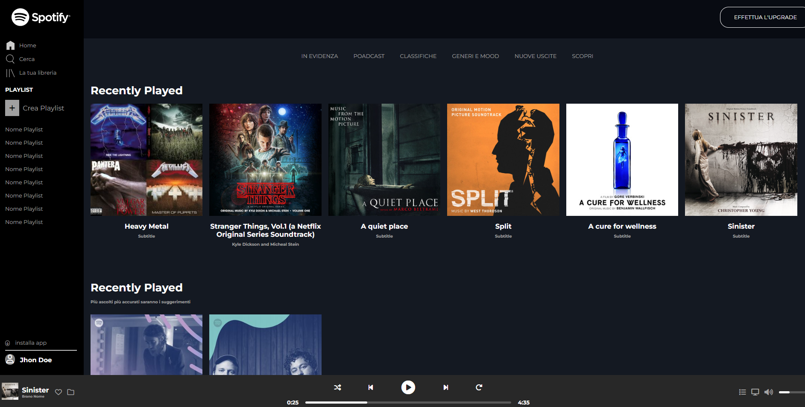
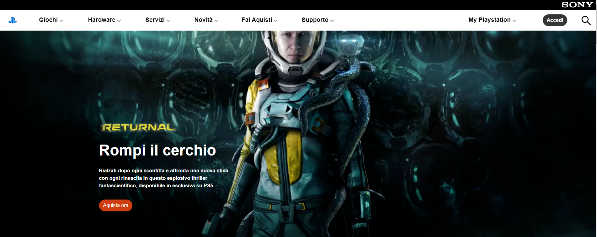

# Benvenuto sul mio profilo Git-Hub

## Sono Biagio Ferro, Junior Full-Stack Web Developer
In questa parte devo mettere una descrizione che per ora non ho

## Progetti (clicca sulle imagini per visualizzare le repository!)

- Sito completamente interattivo e responsive in Vue: 

	 
	
	 

- Web App Whatsaap in Vue

	 

- Blog in Laravel e Vue (grafica grezza, gestione CRUDE ed autenticazione )

https://user-images.githubusercontent.com/101462973/189286962-19ebead0-131a-4b9a-aa83-494d8d042390.mp4

- Web App Spotify (HTML5 and CSS only) 

	 

- Sito Playstation:

	 

	

## Skills:

- [x] Vue
- [x] Laravel
- [x] SQL
- [x] CSS
- [x] HTML5
- [x] Javascript
- [x] SASS
- [x] MySQL
- [x] PHP

	[title](https://www.example.com)
