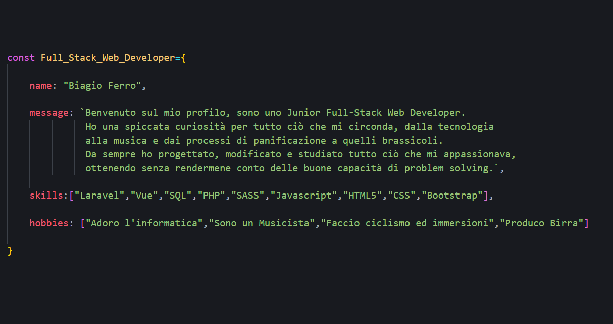

# Benvenuto sul mio profilo Git-Hub

## Sono Biagio Ferro, Junior Full-Stack Web Developer
### La mia più grande passione è creare e progettare, da sempre ho smontato costruito e studiato   ogni cosa che mi passava per le mani
## Skills:

- [x] Vue
- [x] Laravel
- [x] SQL
- [x] CSS
- [x] HTML5
- [x] Javascript
- [x] SASS
- [x] MySQL
- [x] PHP

## Progetti 

    
### Sito interattivo e responsive in Vue: 
>Rproduzione sito KeyNotes ed alcune features (timer funzionante, slider,google maps, video embed)
 
 

https://user-images.githubusercontent.com/101462973/189290545-77739d1a-3562-4acd-aa18-4fe68bed0441.mp4

[Link Repo](https://github.com/bia9400/proj-html-vuejs)
 
 

 
 

### Blog in Laravel e Vue 
>Gestione CRUDE, controllers ed autenticazione. Grafica non ultimata.
 
 

https://user-images.githubusercontent.com/101462973/189286962-19ebead0-131a-4b9a-aa83-494d8d042390.mp4

 
 

### Web App Boolzapp 
>Riproduzione Whatsaap web in Javascript
 
 

https://user-images.githubusercontent.com/101462973/189294800-d1122c8c-5e4e-4c88-948d-4df74ef2a790.mp4

[Link Repo](https://github.com/bia9400/vue-boolzapp)
 
 

	

## Skills:

- [x] Vue
- [x] Laravel
- [x] SQL
- [x] CSS
- [x] HTML5
- [x] Javascript
- [x] SASS
- [x] MySQL
- [x] PHP

	
